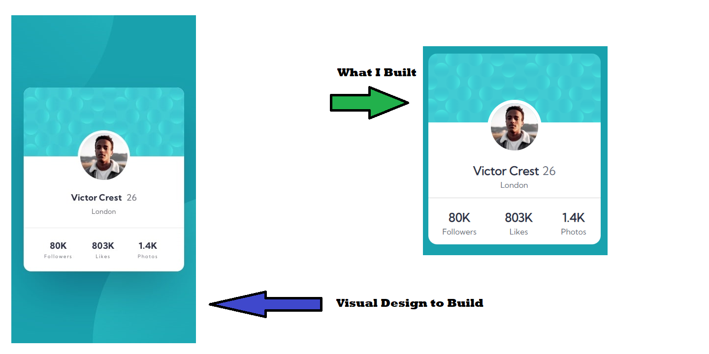

# Profile card component with HTML & CSS

This is a solution to the [Profile card component challenge on Frontend Mentor](https://www.frontendmentor.io/challenges/profile-card-component-cfArpWshJ). Frontend Mentor challenges help you improve your coding skills by building realistic projects. 

## Table of contents
- [The challenge](#the-challenge)
- [Links](#links)
- [Built with](#built-with)
- [What I learned](#what-i-learned)
- [Useful resources](#useful-resources)
- [Author](#author)

### The challenge

- Build out the project to the designs provided

### Links

- [Live Site URL](https://jcsmileyjr.github.io/Profile-card-component/)
- [Read the blog post](https://dev.to/jcsmileyjr/frontend-challenge-4-profile-card-component-46b9)

### Built with

- Semantic HTML5 markup
- CSS custom properties
- Flexbox
- Mobile-first workflow

### What I learned

1. That a mixture of position absolute and relative to a parent and child elements will align elements on the web page outside of the normal flow.
2. To use CSS variables for global styles

Below is code I'm proud of

### Useful resources

- [Quick recap about CSS Variables](https://css-tricks.com/difference-between-types-of-css-variables/)

## Author

- Website - [JC Smiley](https://www.jcsmileyjr.com)
- Frontend Mentor - [@jcsmileyjr](https://www.frontendmentor.io/profile/jcsmileyjr)
- Twitter - [@JCSmiley4](https://twitter.com/JCSmiley4)
